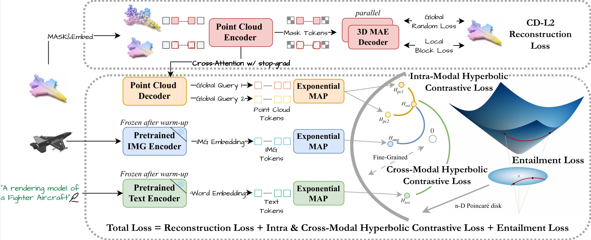

# HyperPoint: Multimodal 3D Foundation Model in Hyperbolic Space
> [**HyperPoint: Multimodal 3D Foundation Model in Hyperbolic Space**]<br>
> [Yiding Sun](https://github.com/Issac-Sun)\*, [Haozhe Cheng]()\*, [Chaoyi Lu](), [Zhengqiao Li](), [Minghong Wu](), [Huimin Lu]() and [Jihua Zhu]() <br>

Xi'an Jiaotong University, Southeast University

This repository contains the code release of **HyperPoint: Multimodal 3D Foundation Model in Hyperbolic Space** (Under Review).

## HyperPoint: Multimodal 3D Foundation Model in Hyperbolic Space

<div  align="center">    
 
</div>

## News
- 📌 Sep, 2025: Check out our exploration of semi-asynchronous federated Learning [**AFBS**](), which has been accepted by **Knowledge-Based Systems.**
- 💥 Aug, 2025: Check out our latest work [**KALMAN**](https://mp.weixin.qq.com/s/qe5bYGUxX14w0_ukhV4Z4Q?scene=1&click_id=2), which achieves national 🥇**1st prize (top 1.5%)** at China Graduate Electronics Design Contest, Shenzhen, China.
- 📌 Aug, 2025: Check out our exploration of efficient 3D gaussian pretraining [**GGM (AvgScore:4.2/5)**](https://github.com/Issac-Sun/GGM), which has been accepted by **PRCV 2025**. See you in Shanghai!
- 🎉 Apr, 2025: [**RETRET**](http://www.fwwb.org.cn/news/show/528) won the 🥇**1st place** at China Service Outsourcing Innovation and Entrepreneurship Competition, Xi'an, China.
- 💥 Mar, 2025: Check out our previous work [**PointDico**](https://github.com/Issac-Sun/PointDico) and [**FedADT**](), which has been accepted by **IJCNN 2025**.
- 🍾 Dec, 2024: [**Magenta**](https://news.xjtu.edu.cn/info/1003/217972.htm) has won the 🥈**2nd prize (top 4%)** at Huawei Cup 2024.
- 🎉 Sep, 2024: I accepted a [**postgraduate recommendation**]() from **Xi'an Jiaotong University**!

## 1. Requirements
PyTorch >= 1.7.0;
python >= 3.7;
CUDA >= 9.0;
torchvision;

```
# Quick Start
conda create -n hyperpoint python=3.10 -y
conda activate hyperpoint

conda install pytorch==2.0.1 torchvision==0.15.2 cudatoolkit=11.8 -c pytorch -c nvidia
# pip install torch==2.0.1+cu118 torchvision==0.15.2+cu118 -f https://download.pytorch.org/whl/torch_stable.html
```

```
# Install basic required packages
pip install -r requirements.txt
# PointNet++
pip install "git+https://github.com/erikwijmans/Pointnet2_PyTorch.git#egg=pointnet2_ops&subdirectory=pointnet2_ops_lib"
```

## 2. Datasets

We use ShapeNet, ScanObjectNN, ModelNet40 and ShapeNetPart in this work. See [DATASET.md](./DATASET.md) for details.

## 3. HyperPoint Models
| Task              | Dataset        | Config                                                               | Acc.       | Checkpoints Download                                                                                     |
|-------------------|----------------|----------------------------------------------------------------------|------------|----------------------------------------------------------------------------------------------------------|
| Pre-training      | ShapeNet       | [pretrain_base.yaml](cfgs/pretrain/base.yaml)                        | N.A.       | [HyperPoint](https://pan.baidu.com/s/1nXwJwkTwY-VITPLF136A1g?pwd=g3b9)           |
| Classification    | ScanObjectNN   | [finetune_scan_hardest.yaml](./cfgs/full/finetune_scan_hardest.yaml) | 90.35%     | [PB_T50_RS](https://pan.baidu.com/s/1drTXo7XmyFfv0HoGFpV8oA?pwd=5pvn)       |
| Classification    | ScanObjectNN   | [finetune_scan_objbg.yaml](./cfgs/full/finetune_scan_objbg.yaml)     | 95.52%     | [OBJ_BG](https://drive.google.com/file/d/1qjohpaTCl-DzHaIv6Ilq0sLAGG2H3Z9I/view?usp=share_link)          |
| Classification    | ScanObjectNN   | [finetune_scan_objonly.yaml](./cfgs/full/finetune_scan_objonly.yaml) | 94.32%     | [OBJ_ONLY](https://pan.baidu.com/s/13p1HXberVTa4qcw-iCaSpw?pwd=mah8)        |
| Classification    | ModelNet40| [finetune_modelnet_8k.yaml](./cfgs/full/finetune_modelnet_8k.yaml)   | 94.2%      | [ModelNet](https://pan.baidu.com/s/1UQvj38snlhLB1uLc6EwPWA?pwd=qt4w)     |


| Task              | Dataset    | Config                                   | 5w10s (%)  | 5w20s (%)  | 10w10s (%) | 10w20s (%) | Download                                                                                       |
|-------------------|------------|------------------------------------------|------------|------------|------------|------------|------------------------------------------------------------------------------------------------|
| Few-shot learning | ModelNet40 | [fewshot.yaml](./cfgs/full/fewshot.yaml) | 97.4 ± 1.9 | 98.9 ± 0.9 | 94.1 ± 4.4 | 95.9 ± 2.2 | [HyperPoint](https://pan.baidu.com/s/1nXwJwkTwY-VITPLF136A1g?pwd=g3b9) |

## 4. HyperPoint Pre-training
Pre-training with the default configuration, run the script:
```
CUDA_VISIBLE_DEVICES=<GPU> python main.py --config <config_path> --exp_name <exp_name>
```
## 5. HyperPoint Classification Fine-tuning
Fine-tuning on ScanObjectNN, run:
```
CUDA_VISIBLE_DEVICES=<GPUs> python main.py --config cfgs/full/finetune_scan_hardest.yaml \
--finetune_model --exp_name <exp_name> --ckpts <path/to/pre-trained/model>
```
Fine-tuning on ModelNet40, run:
```
CUDA_VISIBLE_DEVICES=<GPUs> python main.py --config cfgs/full/finetune_modelnet.yaml \
--finetune_model --exp_name <exp_name> --ckpts <path/to/pre-trained/model>
```
## 6. HyperPoint Few-Shot
```
CUDA_VISIBLE_DEVICES=<GPUs> python main.py --config cfgs/full/fewshot.yaml --finetune_model \
--ckpts <path/to/pre-trained/model> --exp_name <exp_name> --way <5 or 10> --shot <10 or 20> --fold <0-9>
```
## Contact

If you have any questions related to the code or the paper, feel free to email Yiding (`sunyiding@stu.xjtu.edu.cn`). 

## License

HyperPoint is released under MIT License. See the [LICENSE](./LICENSE) file for more details. Besides, the licensing information for `pointnet2` modules is available [here](https://github.com/erikwijmans/Pointnet2_PyTorch/blob/master/UNLICENSE).

## Acknowledgements

This codebase is built upon [Point-MAE](https://github.com/Pang-Yatian/Point-MAE), [Point-BERT](https://github.com/lulutang0608/Point-BERT), [CLIP](https://github.com/openai/CLIP), [Pointnet2_PyTorch](https://github.com/erikwijmans/Pointnet2_PyTorch) and [ACT](https://github.com/RunpeiDong/ACT)

## Citation

If you find our work useful in your research, please consider citing:

```bibtex
TBD
```

